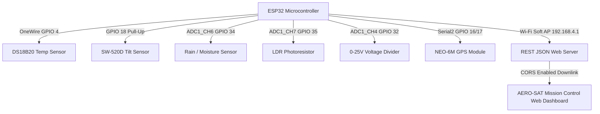

# 🛰️ AERO-SAT ONE — Orbital Sensor Telemetry & Mission Control System

A high-performance aerospace telemetry ground station and ESP32 sensor firmware hub for real-time attitude tracking, environmental sensing, power management, and tactical GPS tracking.

---

## 🚀 System Architecture



---

## ⚡ Pinout & Hardware Connection Guide

> [!IMPORTANT]
> **ADC1 Exclusivity**: All analog sensors are deliberately routed to **ADC1** pins (GPIO 32, 34, 35). This avoids Wi-Fi hardware conflicts, as ESP32 ADC2 channels are disabled when the Wi-Fi radio is actively transmitting.

| Sensor / Module | ESP32 Pin | Interface Type | Operating Voltage | Connection Notes |
| :--- | :--- | :--- | :--- | :--- |
| **DS18B20 Temp** | `GPIO 4` | OneWire Digital | 3.3V | Requires **4.7 kΩ pull-up resistor** between `DATA` & `3.3V` |
| **SW-520D Tilt** | `GPIO 18` | Digital Input | 3.3V | Configured with internal `INPUT_PULLUP` |
| **Rain Drop AO** | `GPIO 34` | ADC1_CH6 (Analog) | 3.3V | Inverted mapping: 4095 (Dry) ➔ 1000 (Submerged) |
| **LDR Photoresistor** | `GPIO 35` | ADC1_CH7 (Analog) | 3.3V | Scaled: 0 (Dark) ➔ 1000 (Direct Sun Lux) |
| **0-25V Voltage Module** | `GPIO 32` | ADC1_CH4 (Analog) | 3.3V | Standard 5:1 divider ($R_1 = 30\text{k}\Omega, R_2 = 7.5\text{k}\Omega$) |
| **NEO-6M GPS Module** | `GPIO 16 (RX2)`<br>`GPIO 17 (TX2)` | HardwareSerial 2 | 3.3V / 5V | ESP32 RX2 connects to GPS **TX**<br>ESP32 TX2 connects to GPS **RX** |

---

## 📡 Ground Station Wi-Fi Access Point Link

The ESP32 runs a dedicated Soft Access Point and REST API:

- **SSID:** `AERO-SAT-AP`
- **Password:** `satellite123`
- **Telemetry URL:** `http://192.168.4.1/telemetry`
- **Poll Rate:** 200 ms (5.0 Hz downlink)
- **CORS:** Enabled (`Access-Control-Allow-Origin: *`) for direct browser access

### 📦 Downlink JSON Telemetry Schema

```json
{
  "temp": 25.0,
  "rain": 0,
  "rainRaw": 3800,
  "ldr": 500,
  "ldrRaw": 2000,
  "voltage": 4.10,
  "battery": 90,
  "tilt": 0,
  "tiltStatus": "LEVEL",
  "heading": 142,
  "pitch": 0.0,
  "roll": 0.0,
  "rssi": -58,
  "gps": {
    "lat": 12.971598,
    "lon": 77.594562,
    "alt": 920.0,
    "speed": 0.0,
    "sats": 0
  }
}
```

---

## 🖥️ Mission Control Ground Station Features

The web dashboard (`index.html`) provides a complete mission control environment:

1. **60 FPS Aerospace HUD Artificial Horizon**:
   - High-fidelity attitude director canvas showing sky/ground divisions, pitch ladder (±10°, ±20°, ±30°), roll bank index, and heading tape.
   - Interpolates SW-520D tilt events smoothly in real time.
2. **Tactical GPS Orbital Map (Leaflet.js)**:
   - Live dark satellite tracking map with pulsating satellite beacon, real-time flight path trajectory trail, and speed/altitude readouts.
3. **5 Mission-Critical Sensor Gauges**:
   - DS18B20 Waterproof Temperature (°C / °F toggle, peak tracker).
   - 0-25V Power Bus with dynamic Li-Po battery percentage bar.
   - SW-520D 3D gyroscopic ball tilt indicator with visual alert.
   - Moisture & Rain drop bar with condition thresholds.
   - LDR Solar Lux meter with day/twilight/eclipse detection.
4. **Multi-Channel Real-Time Flight Recorder**:
   - Chart.js rolling graph plotting Temperature, Voltage, Rain, and Solar Lux.
5. **Teletype Terminal Console & Data Exporter**:
   - Monospace telemetry stream with filter pills (`ALL`, `ALERTS`, `JSON`, `GPS`).
   - One-click **Export CSV** and **Export JSON** data logger.
6. **Built-in Mission Simulator Mode**:
   - Allows full offline testing with synthetic orbital drift and triggerable events without hardware attached.
7. **Web Audio API Synthesizer**:
   - Authentic telemetry chirps, tilt excursion sirens, and button clicks synthesized entirely in software.

---

## 🛠️ Quick Start Guide

### 1. Flash the ESP32 Firmware
1. Open [`firmware/aero_sat_firmware.ino`](file:///c:/Users/BB/OneDrive/Desktop/sat/firmware/aero_sat_firmware.ino) in Arduino IDE.
2. Install the required libraries via **Library Manager**:
   - `TinyGPSPlus` (by Mikal Hart)
   - `DallasTemperature` (by Miles Burton)
   - `OneWire` (by Paul Stoffregen)
3. Select board **ESP32 Dev Module** and upload.
4. Open Serial Monitor at **115200 baud** to verify boot messages.

### 2. Connect & Launch Ground Station
1. On your PC, connect to Wi-Fi: **`AERO-SAT-AP`** (Password: **`satellite123`**).
2. Open [`index.html`](file:///c:/Users/BB/OneDrive/Desktop/sat/index.html) in any modern browser (Chrome, Edge, Firefox).
3. The dashboard will automatically lock onto `http://192.168.4.1/telemetry` and begin streaming live telemetry!
4. To test without powering the ESP32, toggle **`SIMULATOR`** at the top right of the dashboard.
